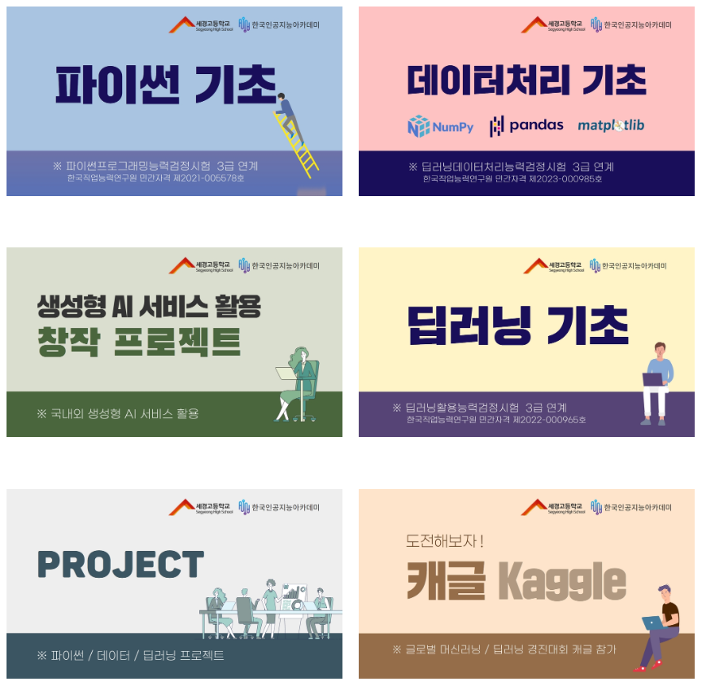
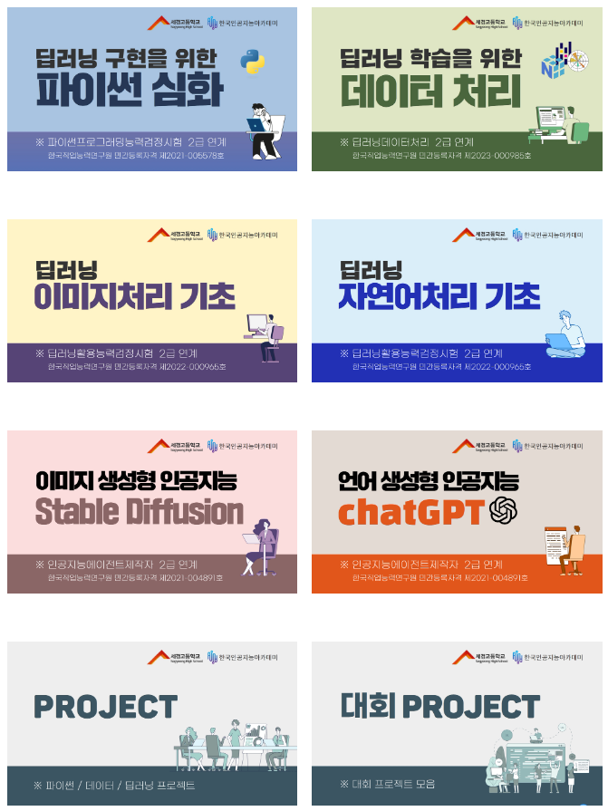

# 미래유망분야 고졸인력 양성사업 학습기록

- 이름: 박정인
- 전공: 컴퓨터프로그래밍

---

이 포트폴리오는 고등학교 생활 동안 인공지능 분야에서 배운 내용과 경험을 담고 있습니다. 1학년 때 파이썬 기초부터 시작해 데이터 처리의 기본, 창의적인 AI 서비스의 활용, 딥러닝의 입문, 그리고 세계적인 데이터 과학 경진대회인 케글까지, 저는 기술적인 기반을 탄탄히 다졌습니다. 2학년으로 접어들면서, 저는 이 지식을 바탕으로 파이썬 심화 학습에 몰두했고, 자연어 처리와 언어 모델을 학습하였습니다. 이 포트폴리오는 제가 직면했던 도전과제들, 해결한 문제들, 그리고 이 과정에서 얻은 교훈과 성취들을 세세히 기록하고 있습니다. 여기 담긴 내용은 저의 학습 경로를 기록하고 있으며, 미래의 교육적인 결정을 내릴 때 귀중한 자료가 될 것입니다.

# 1학년 세션

[1학년 수업 링크](https://sg.ezst.kr/program?class=%EC%84%B8%EA%B2%BD%EA%B3%A0%201%EB%85%84%EC%B0%A8)

### 파이썬 기초 학습 기록:

**개념 이해:** 이 섹션에서는 프로그래밍의 가장 기본이 되는 개념들을 학습했습니다. 프린트 명령어, 숫자 및 문자열 사용법에서 시작하여 데이터 구조의 이해, 리스트 활용, 제어문, 반복문의 구현, 그리고 함수와 클래스의 정의와 사용에 이르기까지 파이썬의 핵심 요소들을 다루었습니다.

**교재와 방법:** 웹툰 형식으로 제작된 교재를 통해 프로그래밍 문법을 보다 친숙하게 접근할 수 있었습니다. 이러한 시각적, 대화형 학습 자료는 복잡할 수 있는 개념들을 쉽게 이해하도록 도와주었습니다.

**실습 경험:** 실습은 웹 기반 환경에서 진행되었으며, 다양한 퀴즈와 미션을 통해 배운 내용을 즉시 적용해볼 수 있는 기회를 제공받았습니다. 이 실용적인 접근 방식은 이론적 지식과 실제 코딩 능력 간의 격차를 좁히는 데 큰 도움이 되었습니다.

**체계적 학습:** 이 과정은 체계적으로 구성되어 있어, 저는 기초적인 출력부터 시작해 점진적으로 더 복잡한 프로그래밍 구조를 마스터할 수 있었습니다. 각 단계에서의 성공적인 학습은 다음 주제로 넘어갈 수 있는 자신감을 주었고, 파이썬의 기초를 튼튼히 다질 수 있었습니다.

### 데이터처리 기초 학습 기록:

**기술 습득:** 데이터 처리 기초 과정에서 저는 데이터 분석과 과학 계산의 핵심 라이브러리인 NumPy와 Pandas를 익혔습니다. NumPy를 통해 효율적인 배열 계산 방법을 배웠고, Pandas를 사용하여 데이터를 조작하고 분석하는 방법을 학습했습니다. 또한, 데이터 시각화를 위해 Matplotlib 라이브러리를 사용하여 다양한 차트와 그래프를 생성하는 방법도 익혔습니다.

**실용적 적용:** 이들 라이브러리를 사용하여 실제 데이터 세트를 처리하고 분석하는 여러 실습을 진행했습니다. NumPy로 기본적인 통계 계산부터 시작해 Pandas를 사용한 데이터 클리닝, 변환, 그리고 데이터 탐색까지 다양한 기술을 실제 문제에 적용해 보았습니다.

**시각화 경험:** Matplotlib를 활용하여 데이터를 시각화하는 기술을 배웠습니다. 이를 통해 수치 데이터가 가진 의미를 시각적으로 표현하고, 복잡한 데이터 세트에서 통찰을 얻는 방법을 배울 수 있었습니다. 데이터의 시각화는 분석 결과를 쉽게 이해하고, 타인에게 효과적으로 전달하는 데 큰 도움이 되었습니다.

**체계적 학습 경험:** 이 과정은 NumPy의 기초부터 시작해 Pandas를 통한 데이터 조작, Matplotlib를 사용한 시각화에 이르기까지 단계별로 설계되어 있었습니다. 각 단계에서의 학습은 다음 주제로의 이동을 자연스럽게 만들었고, 저는 데이터를 처리하고 이해하는 데 필요한 다양한 도구를 숙달할 수 있었습니다.

### 생성형 AI 서비스 활용 학습 기록:

**기술 탐색:** 생성형 AI 기술의 세계로의 여정에서 저는 Midjourney, Stable Diffusion, 그리고 ChatGPT를 활용하는 법을 배웠습니다. 이러한 도구들은 텍스트, 이미지, 그리고 자연어 처리를 통해 창의적인 산출물을 생성하는 데 중점을 두고 있습니다.

**실습 프로젝트:** Midjourney를 사용하여 시각적 스토리텔링의 가능성을 탐구했습니다. Stable Diffusion을 통해 이미지 생성과 조작에 대한 실습을 진행했고, ChatGPT로는 대화형 프로그램을 만들어 인공지능과의 상호작용을 경험했습니다.

**창의적 적용:** 각 서비스를 활용해 실제 문제를 해결하고, 개인 프로젝트에 창의적인 요소를 추가했습니다. Midjourney와 Stable Diffusion을 통해 생성된 이미지는 디지털 스토리북과 프레젠테이션에 활용되었고, ChatGPT는 정보 검색, 작문, 심지어 코딩 문제 해결을 돕는 데 사용되었습니다.

**통합적 학습:** 이 과정은 단순한 기술 사용을 넘어, 창의성과 기술이 어떻게 상호작용하는지를 이해하는 데 중점을 두었습니다. 제가 실습한 프로젝트는 AI의 가능성을 탐구하고, 새로운 형태의 창작물을 제작하는 데 있어 제 능력을 한층 더 향상시켰습니다.

### 딥러닝 기초 학습 기록:

**이론적 이해:** 제 딥러닝 학습 여정은 핵심 개념과 이론적 배경에 대한 깊은 이해에서 시작되었습니다. 뉴런의 기본 원리부터 퍼셉트론의 작동 방식, 그리고 복잡한 신경망의 구조에 이르기까지, 딥러닝의 기반을 형성하는 주요 구성 요소들을 심도 있게 탐구했습니다.

**실습 경험:** 이론적 지식을 바탕으로 TensorFlow 프레임워크를 사용하여 딥러닝 모델을 직접 설계하고 학습시켜 보았습니다. TensorFlow를 통해 데이터를 준비하고, 모델을 구축하며, 학습 프로세스를 관리하는 실질적인 경험을 쌓았습니다.

**모델 구축 및 학습:** 다양한 유형의 신경망을 구축하고 이를 학습시키는 과정을 체험했습니다. 이 과정은 데이터 전처리, 가중치 초기화, 손실 함수의 선택, 옵티마이저 설정, 그리고 학습률 조정 등을 포함했습니다.

**실제 문제 적용:** 실습을 통해, 저는 간단한 분류 문제부터 시작해 점차 복잡한 데이터 세트에 대한 딥러닝 모델을 적용해 보았습니다. 모델의 성능을 평가하고, 이를 향상시키기 위한 다양한 기법을 실험했습니다.

**통합적 이해:** 이 학습 과정은 단순히 딥러닝의 기술적 측면뿐만 아니라, 실제 세계의 복잡한 문제에 적용할 수 있는 능력을 개발하는 데 중점을 두었습니다. TensorFlow를 통한 실습은 저에게 이론을 실제로 구현하고, 실제 문제 해결에 AI를 적용하는 데 필요한 경험과 자신감을 제공했습니다.

# 2학년 세션

[2학년 수업 링크](https://sg.ezst.kr/program?class=%EC%84%B8%EA%B2%BD%EA%B3%A0%202%EB%85%84%EC%B0%A8)

### 파이썬 심화:

**심화 문법 이해:** 파이썬 심화 과정에서 저는 기초 문법을 넘어서 더 복잡하고 강력한 프로그래밍 기법을 배웠습니다. 이 과정은 웹 크롤링, 데이터 전처리, 그리고 고급 파일 조작 기술을 포함하여, 파이썬을 사용하여 실제 데이터 작업 환경에서 흔히 마주치는 문제들을 해결하는 데 중점을 두었습니다.

**웹 크롤링:** 웹 크롤링을 통해 인터넷에서 데이터를 추출하는 방법을 배웠습니다. Beautiful Soup과 같은 도구를 사용하여 웹페이지의 내용을 파싱하고, 필요한 정보를 자동으로 수집하는 방법을 실습했습니다.

**데이터 전처리:** 다양한 데이터 소스로부터 수집한 정보를 전처리하는 기술을 익혔습니다. 이를 통해 데이터를 분석하기 좋은 형태로 정리하고, 데이터 분석에서 가장 중요한 단계 중 하나인 데이터 정제 과정에 대한 중요성을 이해했습니다.

**파일 다루기:** 파이썬의 파일 입출력(IO) 기능을 활용하여 다양한 형식의 파일을 읽고, 쓰고, 수정하는 작업을 배웠습니다. CSV, JSON과 같은 데이터 파일을 다루는 고급 기술을 통해, 데이터 저장 및 관리 능력을 향상시켰습니다.

**프로젝트 적용:** 실제 프로젝트에 이러한 심화 기술들을 적용함으로써, 저는 파이썬을 사용한 데이터 관리 및 분석의 전체 프로세스를 체험할 수 있었습니다. 이 과정을 통해 저는 파이썬이 가진 강력한 기능을 십분 활용하여, 실제 문제를 해결하는 데 필요한 실용적인 기술을 개발했습니다.

### 딥러닝 언어모델 학습 기록:

**자연어처리 기초:** 자연어 처리(NLP)의 기초를 배우며, 텍스트 데이터의 복잡성을 이해하고 기계가 어떻게 언어를 '이해'하게 하는지에 대한 개념을 탐구했습니다. 토큰화, 스테밍, 레마타이제이션과 같은 기본적인 텍스트 전처리 기법부터 시작하여, 자연어의 의미를 파악하고 처리하는 데 필요한 다양한 알고리즘에 대해 학습했습니다.

**언어모델의 역사:** 언어 모델링의 역사적 발전을 추적하며, 초기 모델부터 현재의 고급 모델까지 어떻게 발전해왔는지를 배웠습니다. 이 과정에서 RNN(Recurrent Neural Networks)과 같은 초기의 순차적 데이터 처리 모델부터 시작해, 최근의 Transformer 기반 모델에 이르기까지 주요 기술의 발전을 살펴보았습니다.

**기술 트렌드:** 언어 모델링 기술의 최신 트렌드를 분석하고, 실시간으로 변화하는 기술 환경에 적응하는 방법을 배웠습니다. 특히 Transformer 아키텍처의 작동 원리와 이를 기반으로 한 모델들의 강점과 사용 사례에 대해 심층적으로 탐구했습니다.

**거대 언어모델:** 최신 거대 언어 모델들의 출현과 이들이 어떻게 대규모의 데이터셋에서 학습되며 복잡한 언어 패턴을 학습할 수 있는지에 대해 배웠습니다. 이러한 모델들이 언어 이해, 번역, 요약 및 생성과 같은 다양한 NLP 과제에서 뛰어난 성능을 보이는 이유를 이해했습니다.

**실습과 적용:** 실제로 다양한 언어 모델을 사용하여 텍스트 생성, 감정 분석, 질문 응답 시스템 구축 등의 프로젝트에 적용해보며, 이론적 지식을 실제 문제 해결에 적용하는 경험을 쌓았습니다.

