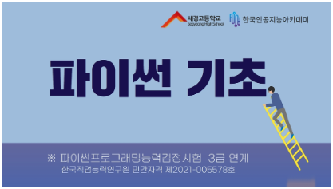
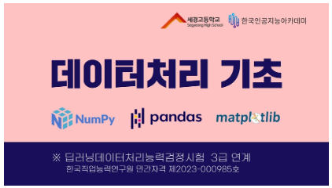

# 미래유망분야 고졸인력 양성사업 학습기록

- 이름: 박정인
- 전공: 컴퓨터프로그래밍

---

이 포트폴리오는 고등학교 생활 동안 인공지능 분야에서 배운 내용과 경험을 담고 있습니다. 1학년 때 파이썬 기초부터 시작해 데이터 처리의 기본, 창의적인 AI 서비스의 활용, 딥러닝의 입문, 그리고 세계적인 데이터 과학 경진대회인 케글까지, 저는 기술적인 기반을 탄탄히 다졌습니다. 2학년으로 접어들면서, 저는 이 지식을 바탕으로 파이썬 심화 학습에 몰두했고, 자연어 처리와 언어 모델을 학습하였습니다. 이 포트폴리오는 제가 직면했던 도전과제들, 해결한 문제들, 그리고 이 과정에서 얻은 교훈과 성취들을 세세히 기록하고 있습니다. 여기 담긴 내용은 저의 학습 경로를 기록하고 있으며, 미래의 교육적인 결정을 내릴 때 귀중한 자료가 될 것입니다.

# 1학년 세션

### 파이썬 기초 학습 기록:

**개념 이해:** 이 섹션에서는 프로그래밍의 가장 기본이 되는 개념들을 학습했습니다. 프린트 명령어, 숫자 및 문자열 사용법에서 시작하여 데이터 구조의 이해, 리스트 활용, 제어문, 반복문의 구현, 그리고 함수와 클래스의 정의와 사용에 이르기까지 파이썬의 핵심 요소들을 다루었습니다.

**교재와 방법:** 웹툰 형식으로 제작된 교재를 통해 프로그래밍 문법을 보다 친숙하게 접근할 수 있었습니다. 이러한 시각적, 대화형 학습 자료는 복잡할 수 있는 개념들을 쉽게 이해하도록 도와주었습니다.

**실습 경험:** 실습은 웹 기반 환경에서 진행되었으며, 다양한 퀴즈와 미션을 통해 배운 내용을 즉시 적용해볼 수 있는 기회를 제공받았습니다. 이 실용적인 접근 방식은 이론적 지식과 실제 코딩 능력 간의 격차를 좁히는 데 큰 도움이 되었습니다.

**체계적 학습:** 이 과정은 체계적으로 구성되어 있어, 저는 기초적인 출력부터 시작해 점진적으로 더 복잡한 프로그래밍 구조를 마스터할 수 있었습니다. 각 단계에서의 성공적인 학습은 다음 주제로 넘어갈 수 있는 자신감을 주었고, 파이썬의 기초를 튼튼히 다질 수 있었습니다.

### 데이터처리 기초 학습 기록:

**기술 습득:** 데이터 처리 기초 과정에서 저는 데이터 분석과 과학 계산의 핵심 라이브러리인 NumPy와 Pandas를 익혔습니다. NumPy를 통해 효율적인 배열 계산 방법을 배웠고, Pandas를 사용하여 데이터를 조작하고 분석하는 방법을 학습했습니다. 또한, 데이터 시각화를 위해 Matplotlib 라이브러리를 사용하여 다양한 차트와 그래프를 생성하는 방법도 익혔습니다.

**실용적 적용:** 이들 라이브러리를 사용하여 실제 데이터 세트를 처리하고 분석하는 여러 실습을 진행했습니다. NumPy로 기본적인 통계 계산부터 시작해 Pandas를 사용한 데이터 클리닝, 변환, 그리고 데이터 탐색까지 다양한 기술을 실제 문제에 적용해 보았습니다.

**시각화 경험:** Matplotlib를 활용하여 데이터를 시각화하는 기술을 배웠습니다. 이를 통해 수치 데이터가 가진 의미를 시각적으로 표현하고, 복잡한 데이터 세트에서 통찰을 얻는 방법을 배울 수 있었습니다. 데이터의 시각화는 분석 결과를 쉽게 이해하고, 타인에게 효과적으로 전달하는 데 큰 도움이 되었습니다.

**체계적 학습 경험:** 이 과정은 NumPy의 기초부터 시작해 Pandas를 통한 데이터 조작, Matplotlib를 사용한 시각화에 이르기까지 단계별로 설계되어 있었습니다. 각 단계에서의 학습은 다음 주제로의 이동을 자연스럽게 만들었고, 저는 데이터를 처리하고 이해하는 데 필요한 다양한 도구를 숙달할 수 있었습니다.

